# Creating out CI/CD Pipeline

## Step 1: Establishing the CI part of the Pipeline on Jenkins


### Pre-requisits:
- GitHub Repo with the `app` folder.
- Jenkins acces.
- Git /bash terminal open for the creating of the SSH key-pair.

---

- So, in the first steps of the Pipeline we have to establish the communication between Jenkins and GitHub, so we can have Jenkins grabbind the app folder from GitHub.
- First, let`s go to Jenkins and create  new job.


- Name it accordingly, then select `Freestyle Project`, and lastly, select `OK`.
- You should now be able to see your newly created job on the dashboard. 


---

- Now, we have to configure our job and make sure it will run the tests that will check the validity of the code in our `app` folder.
- Click on the name of your job on the dashboard, and a new webpage will open, the project`s page.
- Your webpage should now look similar to this:


- On the left side of the Jenkins page, please select `Configure`. 
- In the `Configure` page, in the `General` tab, we have to do the following:

a. Add a description of the job, e.g. in my case I will mention the following `Bulding CI with GitHub web-hhos; Prejoct URL with HTTPS; Repo URL with SSH.

b. Tick the box for `Discard old builds`. In `Strategy`, please go to `Max# of builds to keep` and insert `3`.

c. Tick the box for `Git project`. In `Project URL`, please insert the HTTPS path to the repo whereyou have the `app` folder in GitHub. 


d. Further down, we can find the `Oddice 365 Connector` section. Please tick `Restrict where the project can be run`. Select from the list `sparta-ubuntu-node`.
-If the server has been set properly, this will instruct the server that the conduction of the tests on the code will be done in the `Agent Node`, rather than the `Master Node`.

e. Next, we will see a section called `Source Code Management`. Pleae, Select `Git`.
- In this section we are telling the server to communicate with GitHub using Git via SSH.
- For this, we will need to create an SSH key. 

### For instruction on how to create an `SSH key`, please refer to the following link :

[Creating an SSH Key](https://github.com/FlrMh/SSH_Keys)

- Once or key is ready, let`s continue with the steps. 
- In `Repositories`, in the `Repository URL` bit, please introduce the SSH path to your repo where the `app` folder is, just like previosuly with the HTTPS path. 


- Immediatly after introducing the SSH path, there will be an error prompted, due to the SSH key pai not being connected on both ends: public key(GitHub), private key(Jenkins).
- Then on `Credentials` do not select anything just yet. Click on the `Add` button at the end of the `Credentials` search bar, and select `Jenkins`.
- You will be prompted on a page called `Jenkins Credentials Provider: Jenkins` where you will have to assign the value of your SSH private key. 

a. Leave the `Domain` as it is.

b. On `Kind`, select `SSH Username with Private Key`.

c. Go to `Username` and insert the same name you assigned to your SSH key (the private one, not .pub).

d. On `Private key`, tick `Enter directly`, which will open a text box. You will now need to copy from your local host the content of the private key file, and paste it in the text box showed on Jenkins.

e. Press `Add`. 
d. In the same section, below the `Repository`, you should be able to see `Branches to build`. The default for `Branch Specifier (blank or 'any')`, please replace the default `*/master` with `*/main`.

- Now, in order to establish the connection with GitHub, we need to now go to `GitHub`, in the repository with the `app` folder, and Select `Settings` (for the repo, not Settings for the account).
- Form the left side menu, select `Deploy keys`.


- Now, please select `Add deploy key` from the right top corner.
- Name the key in the same way you name your `SSH key` created locally. 
- In the `Key` text box, we will need to assign the value of our SSH public key. So, locally, open the .pub SSH key file, copy the contents, and paste them on GitHub in the `Key` text box.
- Select `Add key`.
- You should now be able to see your newly created key on GitHub.

- Once our keys are connected, let`s continue with the configuration of our job.
- Further down on the `Configure` page in `Jenkins`, we should be able to see a section named `Build Environment`. Please, tick the box that says `Provide Node & npm bin/ folder to PATH`.

- Lastly, we need to go to the `Build` section, which is where we will write the script that tells the servers the commands to be run on our code.
- Select `Add build step`.
- Because we only want to test that the code is all correct and flawless, in the `Execute shell` Command line, we will simply write the following commands:

```
cd app
 # as we are using a GitHub repository, we need to instruct the server where to run the commands

npm install 

npm test 
# be careful, only mention `npm test` as we do not want to start the app, we are just testing that everything is okay with the app folder and the npm dependecies

```
- Select `Save`.

---

- Now that our configuration is all done, we need o actually run the build we just configured, to make sure everything is set up as we want it to be. 
- From the left side menu on `Jenkins` dahboard, please select `Build Now`. 
- If everything went well and the keys are set properly, we should now be able to see the build running.


- If everything went well, the bubble next to the job should show blue as in the picture.


- If it shows a grey, cloudy bubble, it is still in process.
- A red bubble means that the process failed. In such case, we need to go back and check everything. 

---

Next step will be testing the connection between our local host to Jenkins. So, if we make a change on our local host, and push it to GitHub, will a job be triggered in Jenkins automatically to update the changes we just made? 

Let`s get into it.

- In the `Git Bash` terminal that we opened for the creation of the `SSH key`, we need now to leave the `.ssh` folder, and navigate to the local repo where we have the `app` folder. 
- This is simply a copy of the repo on GitHub that we used the paths from. If by any chance ou do not have this repo locally, you will need to run:
```
git clone <HTTPS path t your GitHub repo>
```
- We will now make a change to one of the files in the `app` folder. I will select the README.md file.
```
nano REDME.md 

# add a line of text

Ctrl + X

Y

Enter


git add .

git commit -m "your-message"

git push -u origin main
# we push the code to the main branch as this is the branch we specified to Jenkins to keep an eye on

```

- You will notice that the line of code is available on `GitHub`, however, a job has not been triggered on `Jenkins`. this is due to not setting up a `Web-hook` on `GitHub` that listens to every change we make to the repo and automatically sends it to `Jnekins`.
- To set up a `Web-hook`, we need to do 2 things:
a. First, go back to `Jenkins`. 
- On the `Jenkins` dashboard, click on our job name, and go again in the `Configure` menu.
- This time, we need to scroll down all the way to a section named `build Triggers`. Please, tick the box that says `GitHub hook trigger for GITScm polling`. 
- We will now need to copy a specific part of the URL of the `Jenkins` webpage. That part will be the IP address and the port where the server is listening. ONLY  COPY UP TO AND INCLUDING THE PORT NUMBER.

b. Now, we need to go to `GitHub`, to the repo where our `app` folder is, and go back to `Settings` (Settings for the repo, not the account settings).
- In `Settings`, on the left side menu, go to `Webhooks`. 
- You will have none existent, so you will need to select `Add webhook`. 
- In the `Payload URL`, please paste the section of the `Jenkins` URL we copied earlier, and add at the end `github-webhook/`.
- For `Content type`, please select `application/json`.
- And lastly, in the section where we are asked `Which events would you like to trigger the webhook?`, select `Just the push event`.
- Select `Add webhook`. 
- If the creation of the webhook has been successful, you should see a green tick next to your Webhook. If not, then the creation failed. It may also take a while until the green tick appears, so to double check, simply refresh the page. 


- If everything went well, we should now be able to push changes to our `GitHub` and automatically see jobs being triggered in `Jenkins`.

---

## Step 2: Setting up the CD part of the Pipeline between Jenkins and AWS


- For the `CD` part of the Pipeline, we will follow the above diagram.
- So, Job 1 requires us to set up a `dev` branch on our local host and on GitHub.
- To achieve that, please go to yor `Git Bash` terminal on your local host and run the following:
```
git checkout -b <branch-name>

git push <remote-name> <branch-name> 
# remote-name will generally be 'origin'
```
- Once the dev branch is done, change the configuration of the `CI` job in `Jenkins` to listen to the `dev branch` instead of the `main branch`.

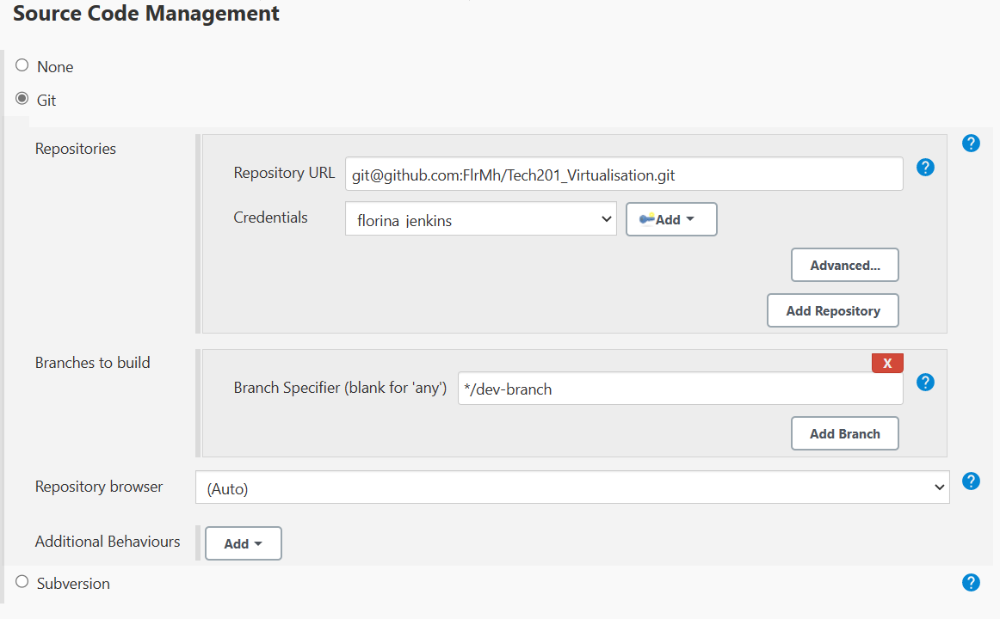

- To test that the branch is set correctly, make a change to any file in the repo, and push it to GitHub. You should able to currently see the changes only on the `dev branch`, not on the `main branch`, as they are not yet merged. 
- Now, we need to create a second `Jenkins` job that will merge the `dev branch` with the `main branch`. 
- Create a `new item` in Jenkins, and select `freestyle project`. 
- The configurations should be similar to the ones described above. Onnly a few things should be changed:

1.

 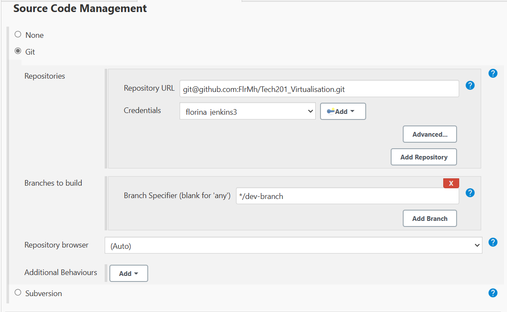

2.

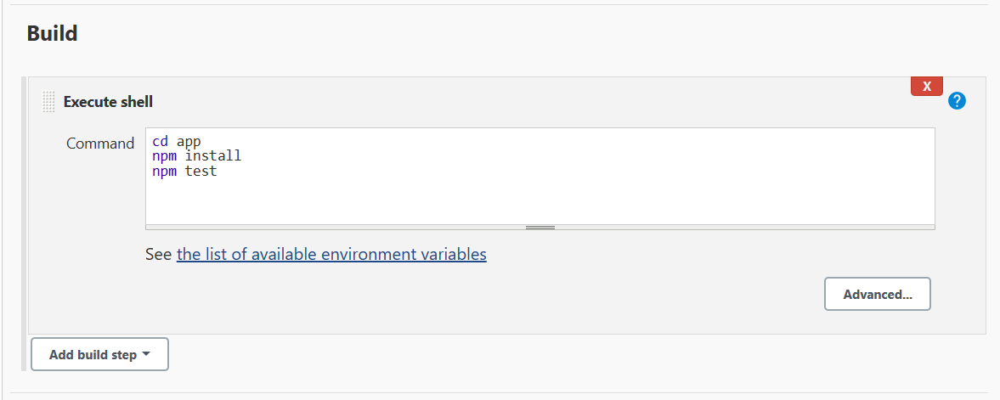

3. 

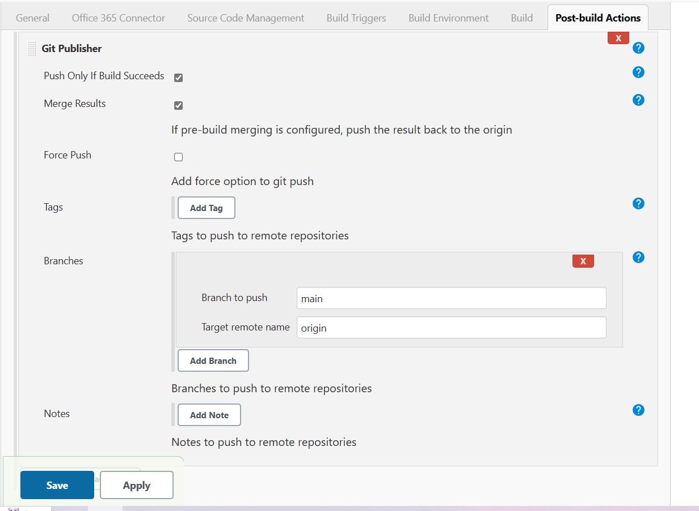

- Now, every time we push a change through out `dev` branch, if the code tests are successful, the changes to the `dev` branch should be merged onto the `main` branch. 

- The changes I have made are visible below, screenshotted on my `main` branch in GitHub. Th changes were pushed through my `dev-branch`, which triggered the job in `Jenkins`, which then merged the branches together.

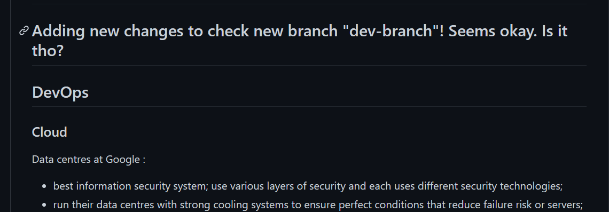

---

- As Job 1 and Job 2 from the diagram have been achieved, it is time for Job 3: pushing the code to AWS.

- Firstly, we will need to set up an EC2 instance.
- If unsure how to achieve that, please follow the steps on the following link:

    [Setting up an EC2 instance](https://github.com/FlrMh/Cloud_Computing_with_AWS/blob/main/AWS_instructions.md)

---

### Few things to remember for AWS instance!!!
1. The Security Group for this instance should allow `Jenkins` on `port 22`, so remember to use the IP address of Jenkins in the https link of the Jenkins page. 
- Also, allow `port 80`, `port 3000` and `port 8080`.


2. Save the `devops-tech201` .pem file, the key for EC2 instances, in the local host and then add it to `Jenkins` for when we will connect the EC2 instance with Jenkins.

- Anything else, in terms of the EC2 instance ocnfiguration, should be the same as previously made. 
---

- Now, in `Jenkins`, we need to create a new item. 
- Set the name as pick a `freestyle project`.
- Set the description, connect it to the `GitHub` repo as previously made, with the `HTTPS` and `SSH`.
- No need to restrict the environemtn as we are not testing anything at the moment. 
- Use `*/main` branch to build.

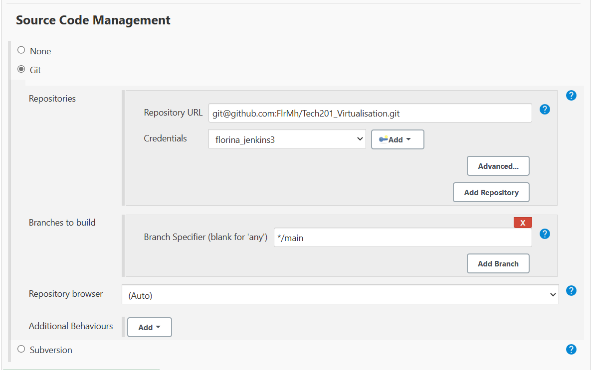

- `Build triggers` to `"Build only if build is stable"` and specify the previous job we made where we check that the code is tested and runs as expected.

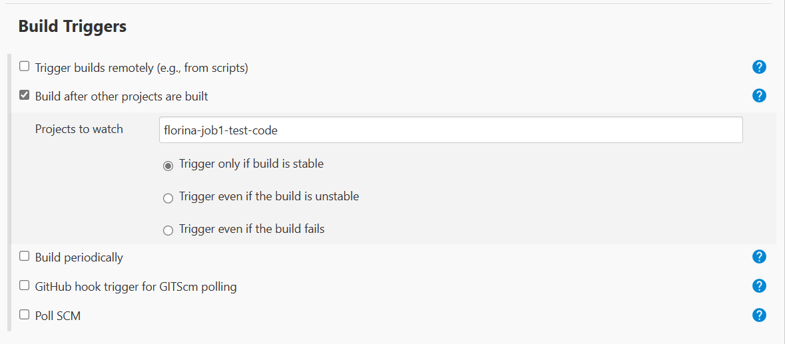

- Add the `SSH` authentication path and use the `devops-tech201` key for the EC2 instance. This will allow `Jenkins` to be the one that communicates with the EC2 instance so we would not have to do it. 

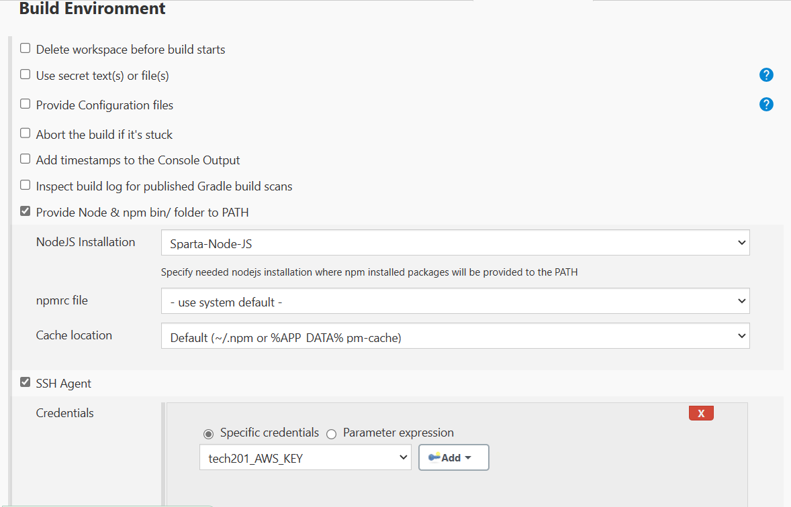

- Sync the required files using the `Command shell` section with the following commands:
```
rsync -avz -e "ssh -o StrictHostKeyChecking=no" app ubuntu@ip:/home/ubuntu
ssh -o "StrictHostKeyChecking=no" ubuntu@ip <<EOF
    sudo bash ./app/provision.sh
    cd app
    npm install
    nohup npm start 2>/dev/null 1>/dev/null&

EOF

```
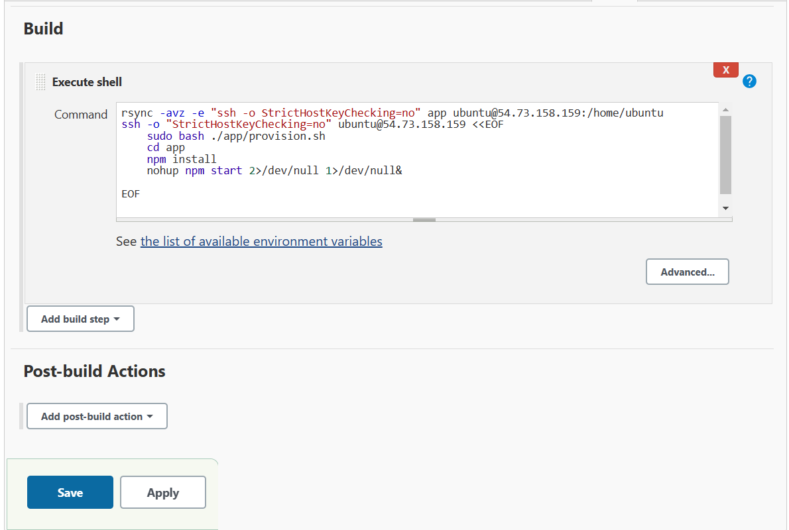

- If everything went well and pipeline ran correctly, any changes made locally through our `dev` branch should be going through the entire pipeline, which will end with the changes made locally being deployed in the Production environment (our EC2 instance).
- In my case, I will make some changes within the home page of the `app` using my newly created `dev-branch` branch.
- In order to achieve this, I used the following commands:

```
cd app

cd views

nano index.ejs
# in the endex.ejs file we have the configuration for the homepage of our app

# my changes will add 2 subheadings to the app homepage as you can see in the screenshot below
```

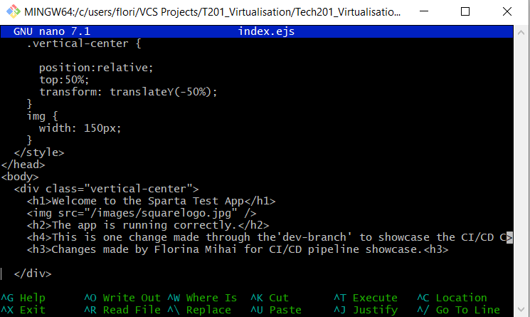


- Then, I ran the commands that run the code through the `Git` workflow:
```
git add .
git commit -m "my text"
git push -u origin dev-branch
```
- As my changes were sent to `GitHub`, the Pipeline will now start working as `Jenkins` is listening to the changes I make to my repo on `GitHub` through the Webhook we have set.
- Each job will now individually be triggered as the Pipeline has been instructed to.
- Lastly, as my code was all tested successfully, my branches were then merged (the changes made on `dev-branch` were merged onto the `main` branch), and the main build has been delivered and automatically deployed onto my EC2 instance.
- The result will be to see the changes that I made locally now being successfully added onto my `app` homepage.

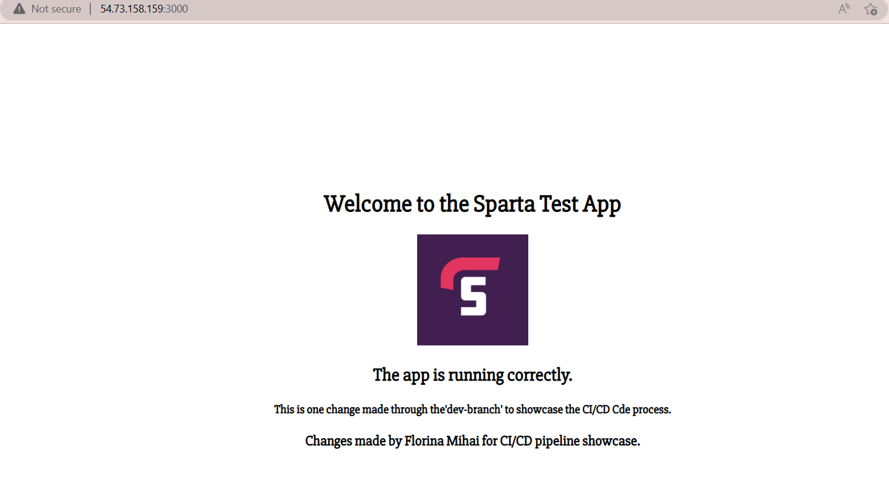

- Happy days! My Pipeline automated the process of integrating, testing, delivering and deploying the code for my `app`.
