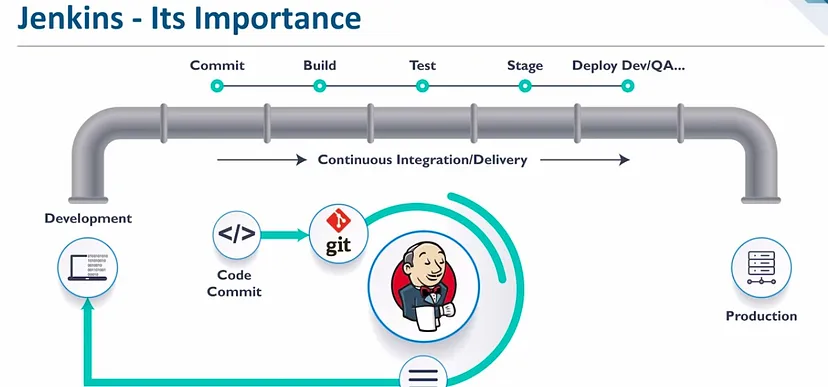

# CI/CD Pipelines
Introduction to CI/CD CDe Pipelines and their benefits.

---

DevOps is a software development methodology that combines software development (Dev) and IT operations (Ops), the two pillars of the entire service life-cycle. This means all the processes from design, through to the development process, and all the way up to productio stage.

As it bridges a gap between 2 departments previously working in silos(Dev and Ops), DevOps is completely focused on automating the processes within the Software development lifecycle, and therefore DevOps engineers must learn how to master the application of CI/CD (CDe) Pipelines.

CI CD is considered as the backbone of DevOps practices and automation, as it plays a vital role in DevOps engineers` abbility to release software faster to their clients, ensuring quicker client satisfaction.

---

## SDLC Workflow

The Software Development Life Cycle (SDLC) is a process for developing and delivering high-quality software. While the specific steps may vary depending on the organization, industry, and project, the typical SDLC workflow includes the following stages:

1. Planning: In this stage, the project goals, requirements, scope, and timeline are defined. A feasibility study may also be conducted to determine if the project is viable.

2. Analysis: In this stage, the requirements are analyzed and documented in detail. This stage also includes identifying risks and constraints and designing a solution that meets the requirements.

3. Design: In this stage, the software architecture and system design are developed. This includes creating detailed technical specifications and designing the user interface.

4. Implementation: In this stage, the software is developed and tested. This includes coding, unit testing, integration testing, and system testing.

5. Deployment: In this stage, the software is released to users or customers. This includes installation, configuration, and training.

6. Maintenance: In this stage, the software is monitored and updated as needed. This includes bug fixes, patches, upgrades, and enhancements.

7. Retirement: In this stage, the software is phased out or replaced. This includes archiving data, transitioning to a new system, or retiring the software altogether.

By following the SDLC workflow, organizations can ensure that software is developed and delivered in a structured and systematic way, with quality, efficiency, and customer satisfaction in mind.

---

## CI/CD Pipeline

---

## What is CI?

**Continuous integration (CI)** = the process of *automating and integrating code changes and updates* from many team members during software development. 
- In CI, automated tools confirm that software code is valid and error-free before it's integrated, which helps detect bugs and speed up new releases.

---

## What is CD?

**Continuous Delivery (CD)** refers to the practice of *frequently and automatically testing code changes, and preparing them for release into production*. 
- Once the code changes are verified and validated, they are stored in a production-ready state, awaiting the final approval for deployment.
- Within a CI/CD Pipeline, the *deployment of the working software is done manually*.
---

## What is CDe?

**Continuous Deployment (CDE)** takes the process one step further and *automatically deploys the changes into production as soon as they pass the testing and approval process*. 
- This means that *every change made to the codebase is released to production without manual intervention*.

--- 

### **Please Note**
-  The difference between CD and CDe is very subtle, but extremely important.
- Both Continuous Delivery and Continuous Deployment aim to make the release process faster, more reliable, and less error-prone by automating the testing and deployment process.
- However, in order to understand when to use CDe, one must have an exceptional understanding of the CI/CD CDe Pipelines and when it is recommended to use CDe.

#### ***CDe is not recommended in certain situations, such as:***

- High-risk projects: If the project involves a high level of risk, such as those that impact mission-critical systems, it may not be advisable to use CDe as it can increase the risk of introducing new bugs or errors that could impact the stability and reliability of the system.

- Inadequate testing: If the project does not have an adequate testing process in place, using CDe can lead to the release of untested or poorly tested code, which can result in unexpected issues and errors.

- Lack of collaboration: If the team members do not have good collaboration and communication practices in place, using CDe can lead to a breakdown in communication and collaboration, which can result in issues such as conflicting code changes and errors.

- Immature processes: If the project's development processes are not yet mature, using CDe can lead to additional complexity and confusion, making it harder to achieve the desired results.

In general, CDe is recommended for teams that have a good understanding of the benefits and limitations of the practice, and have established the necessary processes and tools to ensure that code changes are thoroughly tested and validated before being deployed to production. 

---

## Jenkins

Jenkins is an extremely powerful, open-source automation server that is widely used for implementing Continuous Integration (CI) and Continuous Delivery/Deployment (CD/CDe) in software development.
- It enables developers to easily build, test, and deploy code changes across various platforms and environments.

### Why use Jenkins?

1. Flexible and customizable: Jenkins is highly customizable and can be extended with a vast number of plugins, making it an ideal tool for various types of software development and deployment workflows.

2. Integrates with various tools and technologies: Jenkins can integrate with various tools, such as version control systems (e.g., Git), build tools (e.g., Maven, Gradle), and deployment tools (e.g., Ansible).

3. Automates repetitive tasks: Jenkins automates repetitive tasks, such as code builds, testing, and deployment, saving time and reducing human error.

4. Provides insights and feedback: Jenkins provides developers with continuous feedback about the code quality, test results, and deployment status, enabling them to quickly identify and fix issues.

5. Cost-effective: Jenkins is free and open source, making it an attractive choice for organizations looking for a cost-effective solution for their CI/CD needs.

The choice of a CI/CD tool depends on the organization's specific requirements, budget, and technology stack. Each tool has its strengths and weaknesses, and it's essential to evaluate them thoroughly before making a decision.

- Possible other options than Jenkins: 

a. GitLab.

b. Travis CI.

c. CircleCI.

d. Bamboo.

### Jenkins Workflow

- Jenkins is an open-source automation server that provides a wide range of plugins and integrations to support continuous integration and continuous delivery (CI/CD) workflows. 
- Jenkins Workflow, also known as Jenkins Pipeline, is a plugin that extends Jenkins to provide a powerful tool for creating and managing complex, multi-stage software delivery pipelines.

While Jenkins is a powerful tool for automating software builds, testing, and deployment, Jenkins Workflow takes it to the next level by enabling developers to define and visualize entire software delivery processes, from code commit to production deployment. With Jenkins Workflow, developers can create workflows that incorporate multiple jobs, stages, and tasks, with support for parallel and sequential execution.

